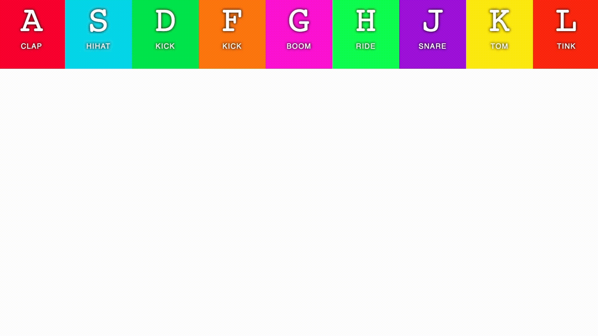



# JavaScript30

I am following along the JavaScript30 tutorials and adding my own twist on the concepts I've learned from each lesson.
JavaScript30 repo: https://github.com/wesbos/JavaScript30

## Lesson One: DrumKit  

I used the concepts I learned in lesson one to create a rainbow that expands as you hit your home row keys. To achieve this effect, I layered two divs for each letter. The bottom div is empty and leverages the transform effect to scale vertically on the event click. Once the tranform is over, the class is removed and the div transitions back to its original state.

